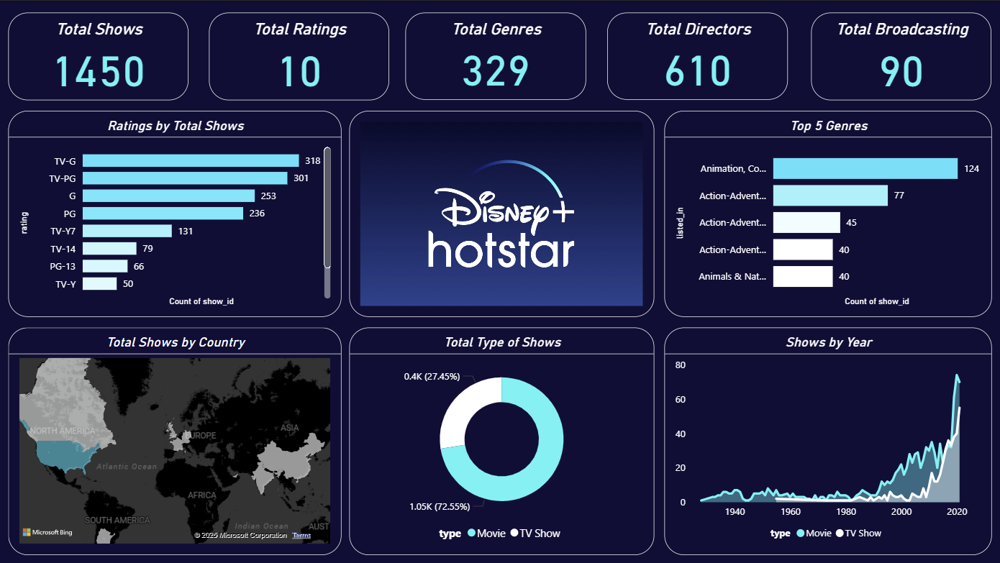

# Disney-Hotstar-Content-Analytics-Dashboard
A modern, interactive analytics dashboard built to explore and visualize Disney+ Hotstar’s content library. This project provides insights into shows, genres, ratings, countries, and content trends over time using an intuitive and visually rich interface.
## 🚀 Project Overview
This dashboard analyzes 1,450+ shows available on Disney+ Hotstar and presents key metrics in a single, consolidated view.
It is designed for data analysts, business stakeholders, and streaming platform researchers to quickly understand content distribution, popularity patterns, and historical growth.
## 🎯 Key Features
High-level KPIs
Total Shows
Total Ratings
Total Genres
Total Directors
Total Broadcasting Countries
Ratings Analysis
Distribution of shows across ratings (TV-G, TV-PG, PG-13, etc.)
Genre Insights
## Top 5 genres by number of shows
Clear comparison of genre popularity
Content Type Breakdown
Movies vs TV Shows using a donut chart
## Geographical Distribution
World map showing total shows by country
Time-Series Trend
Growth of Movies and TV Shows over the years
Dark UI Design
Professional, modern, and presentation-ready layout
## 🧠 Insights You Can Derive
Family-friendly and general audience content dominates the platform
Movies form the majority of the catalog compared to TV shows
Strong content growth post-2000, with a sharp rise after 2015
Animation and Action-Adventure are the most popular genres
Content is globally distributed, with a strong international presence
## 🛠️ Tools & Technologies Used
Power BI – Dashboard development & data modeling
Data Visualization – KPI cards, bar charts, donut charts, maps, line charts
Dark Theme UI – Custom formatting for professional appearance
(If recreated using another BI tool, mention it here accordingly)
## 📂 Dataset Information
Source: Publicly available Disney+ Hotstar content dataset
### Data includes:
Show titles
Ratings
Genres
Directors
Countries
Release years
Content type (Movie / TV Show)
## 📸 Dashboard Preview

## 📈 Use Cases
Streaming platform content analysis
Business & marketing insights
Portfolio project for data analysts
Learning reference for Power BI dashboard design
Executive-level reporting demo
## 📌 How to Use
Download or clone this repository
Open the Power BI file (.pbix)
Refresh the dataset if required
Explore insights using filters and visuals
## 🤝 Contributing

Contributions are welcome!
Feel free to fork the repository, enhance visuals, add new insights, or optimize performance.

## 📬 Contact

Author: Subhodip Sarkar
📧 officialsubhodip@gmail.com
💼 Data Analytics | BI Dashboards | Visualization

⭐ If you found this project useful, don’t forget to star the repository!
